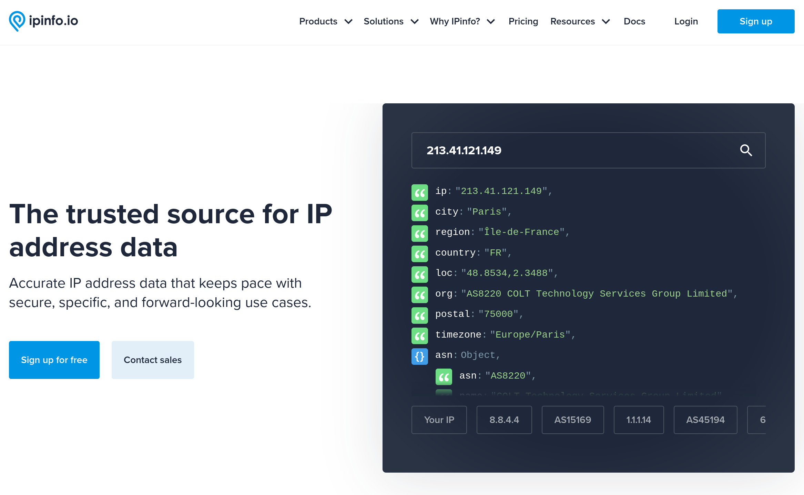
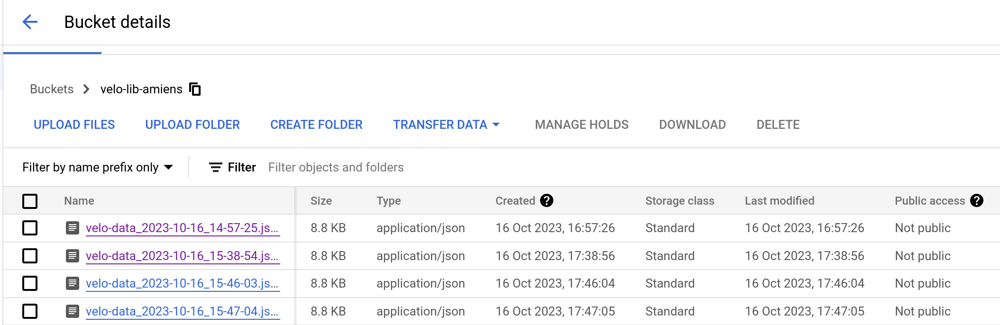

# Self-service bicycles - Gcp-data-collection

<small>Bicycles in self-service. (Service de Vélo lib in French)</small>

#### <u>Student</u> : ZOUNON Ahouefa Sharonn

<!-- TABLE OF CONTENTS -->
<details>
  <summary>Table of Contents</summary>
  <ol>
    <li><a href="#project-description">Project Description</a></li>
    <li><a href="#authentication-on-gcloud">Authentication on gcloud</a></li>
    <li><a href="#cloud-storage-bucket">Cloud Storage (Bucket)</a></li>
    <li><a href="#cloud-pub-sub">CLoud Pub/Sub</a></li>
    <li><a href="#cloud-function">Cloud Function</a></li>
    <li><a href="#cloud-scheduler">Cloud Scheduler</a></li>
    <li><a href="#deploy-the-project-cost">Cost of project deployment</a></li>
    <li><a href="#contact">Contact</a></li>
    <li><a href="#acknowledgments">Acknowledgments</a></li>
  </ol>
</details>

<!-- PROJECT -->

## Project Description

This project is part of the red thread project for the PAAS Google course that I've been taking preparing my master's
degree in
Cloud Computing. <br/>

This part focuses on collecting the data and storing it in a bucket on GCP (Google Cloud Platform). After collection,
the data will be
processed (filtering, ...) and used for training an AI model.

The purpose of the entire project is to create an AI based app that will be able to predict the "affluence" of people in
a station
and the availability of the bicycles in a station. It will advise its users whether they should wait for a bicycle or
should go and check another at station.

We are focusing on the stations in Amiens (80000, 80080, 80090, France). The service is named **Velam**.

For this part I am using python as programming language.

We are using the [JCDecaux API](https://developer.jcdecaux.com/#/opendata/vls?page=getstarted) for the data on the velo
lib stations.

We will be storing data for ***1 month***.

> For calling their API, you have to use the following request with the corresponding
> information: ```GET https://api.jcdecaux.com/vls/v1/stations?contract={contract_name}&apiKey={api_key}``` <br/>
> For the ***contract_name*** variable, the accepted values are listed
> at [contracts](https://developer.jcdecaux.com/#/opendata/vls?page=static) <br/>
> To have the list of all the
> contracts: ```curl https://api.jcdecaux.com/vls/v1/contracts?apiKey={api_key} > contracts.json ``` <br/>
> For the ***api_key*** variable, you have to create an account on their page, and you will receive an API key which you
> should use. <br/>
> For more information, please feel free to
> check: [JCDecaux](https://developer.jcdecaux.com/#/opendata/vls?page=getstarted)

## Authentication on gcloud

For the local development, I had to set up user's credentials. <br />

* Install and initialize the gcloud cli
    ```shell 
      # I am on fedora workstation 38
      sudo dnf install google-cloud-cli  # install
  
      gcloud init  # initialize
  
      gcloud config set project paas-gcp-insset-2023  # change the project
    ```
* Create credential file (ADC - Application Default Credentials)
    ```shell 
      gcloud auth application-default login
    ```

## Needed APIs

* Cloud Resource Manager [cloudresourcemanager.googleapis.com]
* Cloud Storage [storage-component.googleapis.com ] (It is enabled by default, so no need to enable it.)
* Pub/Sub API [pubsub.googleapis.com]
* Artifact Registry [artifactregistry.googleapis.com] (for the cloud functions)
* Cloud Logging [logging.googleapis.com] (for the cloud functions)
* Cloud Run [run.googleapis.com] (for the cloud functions)
* Cloud Build [cloudbuild.googleapis.com] (for the cloud functions)
* Eventarc [eventarc.googleapis.com] (for the 2nd generation of cloud functions)
* Cloud Functions [cloudfunctions.googleapis.com]
* Cloud Scheduler [cloudscheduler.googleapis.com]

To enable the APIs, run the following command line:

```shell
gcloud services enable cloudresourcemanager.googleapis.com pubsub.googleapis.com artifactregistry.googleapis.com\
 logging.googleapis.com run.googleapis.com cloudbuild.googleapis.com eventarc.googleapis.com \
  cloudfunctions.googleapis.com cloudscheduler.googleapis.com
```

## Cloud Storage (Bucket)

A bucket is a container storing the data. It's used for storage and helps organize our data.

It can store pretty much anything: ```text (.txt, .json, ...), media (images, videos,...)```

There is no limit to the number of buckets you can have in a project or location.

You have to keep in mind that **Every bucket name must be globally (worldwide) unique**.

While creating one, we can specify the project, the location and the storage class.

#### Finding information on JCDecaux's API

```shell
# We have to determine the location of the JCDecaux's API to choose the best location
# In order to reduce, mainly, the cost of networking (request done by the cloud function to fetch the data)

# Get the API address
❯ nslookup api.jcdecaux.com
Server:         127.0.0.53
Address:        127.0.0.53#53

Non-authoritative answer:
Name:   api.jcdecaux.com
Address: 213.41.121.149
Name:   api.jcdecaux.com
Address: 213.41.121.85

# Get info on the API address
❯ curl https://ipinfo.io/213.41.121.149
{
  "ip": "213.41.121.149",
  "city": "Paris",
  "region": "Île-de-France",
  "country": "FR",
  "loc": "48.8534,2.3488",
  "org": "AS8220 COLT Technology Services Group Limited",
  "postal": "75000",
  "timezone": "Europe/Paris",
  "readme": "https://ipinfo.io/missingauth"
}

# Their API is in Paris so we will use "europe-west9" as location when it is possible because some gcp services might not be available in this location.
```



My bucket name is: ***velo-lib-amiens*** <br/>
I chose the location: ***EUROPE-WEST9*** (located in Paris) which is the closest location to where JCDecaux stores their
data.
Plus, it has low carbon emission and is also the closest to me (who is currently the user). <br/>
I chose the ***standard*** storage class. I thought it would be the best because, I am going to use it after for
training the model, so I will be accessing the data more often.

The command line to create a bucket is the following.

```shell 
# If you have multiple projects, you have to specify the project ID
# gcloud storage buckets create gs://<bucket_name> --project=<project_id> --default-storage-class=<storage_class> --location=<location> --uniform-bucket-level-access

# I have a configuration file with my default project so I use it to fill the project variable. 
gcloud storage buckets create gs://velo-lib-amiens --project=$(gcloud config get-value core/project) --default-storage-class=STANDARD --location=europe-west9 --uniform-bucket-level-access
```

## CLoud Pub/Sub

The Pub/Sub service is an asynchronous and scalable messaging service that decouples services producing messages from
services processing those messages. <br/>
It allows services to communicate asynchronously.

For the data collection, we will use it to trigger the function that will fetch the data.

To use it, you have to enable the API which I did earlier.

```shell
# Create topic with the desired id (a string)
# gcloud pubsub topics create <id_topic>
gcloud pubsub topics create velo-lib-amiens-topic

# Create a subscription with the desired id and attach it to the created topic using its id
# gcloud pubsub subscriptions create <subscription_name> --topic=<created_topic_id>
gcloud pubsub subscriptions create velo-lib-amiens-sub --topic=velo-lib-amiens-topic

# Receive messages from the subscription
# gcloud pubsub subscriptions pull <sub_id> --auto-ack
```

## Cloud Function

A cloud function is a serverless execution environment for building and connecting cloud services. With these you write
simple, single-purpose functions that are attached to events emitted from your cloud infrastructure
and services. Your function is triggered when an event being watched is fired, or by an HTTP request.

We are creating a function triggered by a pub/sub topic. It will be triggered when the subscription will send a message.

We will use the function to fetch the data and store it in the bucket.

You also need to enable the API and the ones that it needs to run. While enabling the cloud function API, if you did not
enable the dependant APIs, it will be asked to you whether you want to enable them or not.

I advise you to accept. It will not work either way.

They are multiple parameters that you can specify. I will explain what are the ones that I specified.

* ```--gen2``` to create gen 2 cloud functions
* ```--runtime``` the function programming language
* ```--region``` the region where the cloud function will be deployed
* ```--source``` the source code of the cloud function
* ```--memory``` the memory taken by the cloud function
* ```--entry-point``` the entry point function of the cloud function (the main function)
* ```--trigger-topic``` the trigger of the cloud function (which is a pub/sub topic)
* ```--env-vars-file``` the file containing the environment variables (I specified it because I am using them)
* ```--retry``` it specified that the function must run again if it does not work once

```shell
# Deploying the function
gcloud functions deploy python-get-velo-lib-data-function \
--gen2 \
--runtime=python311 \
--region=europe-west9 \
--source=. \
--memory 128Mi \
--entry-point=get_data \
--trigger-topic=velo-lib-amiens-topic \
--env-vars-file=.env.yaml \
--retry

# Triggering the function using the pub/sub topic
# I am not using the message, so it does not matter what it is
gcloud pubsub topics publish velo-lib-amiens-topic --message="Friend"

# See the logs of a cloud function
# gcloud functions logs read --gen2 --region=<region> <function_name> > func_logs.txt
gcloud functions logs read --gen2 --region=europe-west9 python-get-velo-lib-data-function

# Delete an existing function
# gcloud functions delete <function_name> --gen2 --region <region>
gcloud functions delete python-get-velo-lib-data-function --gen2 --region europe-west9
```

## Cloud Scheduler

Cloud Scheduler is a fully managed cron job scheduler. It allows you to schedule virtually any job,
including cloud jobs, cloud infrastructure operations, and more.

You also need to enable the API if you did not earlier.

We will create a scheduler with a pub/sub as a target because it is the one that is triggering the function for fetching
the data.

I chose the location ***europe-west3*** (Belgium) because the scheduler is not available in the ***europe-west9*** (
Paris) location.

The scheduler will run the pubsub sending message line every ***one*** minute.

I chose **1 minute** as the scheduler frequency because it is said in JCDecaux's documentation that the data is updated
every minute.

```shell
# Create a scheduler with a pubsub target - It launches every minute
# gcloud scheduler jobs create pubsub <scheduler_name> --location=<location> --schedule="* * * * *" --topic=<topic_id> --message-body=<message>

gcloud scheduler jobs create pubsub velo-lib-amiens-job --location=europe-west3 --schedule="* * * * *" --topic=velo-lib-amiens-topic --message-body="Friend"
```

To calculate the schedule parameter value:

```shell
# ┌───────────── minute (0 - 59)
# │ ┌───────────── hour (0 - 23)
# │ │ ┌───────────── day of the month (1 - 31)
# │ │ │ ┌───────────── month (1 - 12)
# │ │ │ │ ┌───────────── day of the week (0 - 6) (Sunday to Saturday;
# │ │ │ │ │                                   7 is also Sunday on some systems)
# │ │ │ │ │
# │ │ │ │ │
# * * * * * <command to execute>
```

<small> <em><u>Source:</u> <a href="https://en.wikipedia.org/wiki/Cron#Overview">CRON by Wikipedia</a> </em> </small>

## Deploy the project (Cost)

We all have for starters: **$50** for the billing of this project.

We have to make sure that everything we are doing now and all the services that we are using will not cost more than $50
after one month.

Thus, we have to calculate the cost of every service used.

#### Determination of the number of API calls in 1 month

I chose a frequency of 1 minute to fetch the data. A call to the API will then be performed every minute
***(60 calls/hour)***.

In 1 month, we will have (approximately): ***(60/1)x(24)x(31)*** = **44640 calls**.

I say *approximately* because I didn't run the function on the first day of the month, and I am not sure whether the
next séance is actually the 31st day after the launch of the function. It can then be more/less than 44640 calls. I'm
basing the further calculations on 44640 calls.

#### Cloud Storage (bucket)

- The data storage price depends on the bucket location and on the bucket storage class. You pay per stored GB/month.
- For me, the data is stored in the *europe-west9/Paris* location and the bucket is a *STANDARD* class.

  |       Location       | Standard storage | Nearline storage | Coldline storage | Archive storage |
  |:--------------------:|:----------------:|:----------------:|:----------------:|:---------------:|
  | Paris (europe-west9) |      $0.023      |      $0.013      |      $0.006      |     $0.0025     |

- A single call to the JCDecaux API results in an **8.8KB** JSON file stored in the bucket.



```python
kb_per_month = 8.8 * 44640  # 392832
gb_per_month = kb_per_month / 1000000  # 0.392832

# We then have 0.392832 GB / month
cost = gb_per_month * 0.023  # $0.009035136 /month
```

- The approximate cost: **$0.009,035,136/month** (0,009 035 136 €)

<small> <em> <u>Source:</u> <a href="https://cloud.google.com/storage/pricing#europe">Cloud Storage Pricing</a> </em> </small>

#### Pub/Sub cost

- It is mentioned on the gcp pub/sub pricing page that
  ***All customers get up to 10 GB for ingestion or delivery of messages free per month, not charged against your
  credits.
  pricing is calculated based upon monthly data volumes.*** <br/>
  So, the first **10 GB** of data per month is offered at no charge. And beyond 10GB, you will pay $40.00/TB
- We are using the pubsub to trigger the cloud function fetching and storing the data in a bucket. We are not storing
  anything in the pubsub we will then consume 0o/month which result in $0/month.
- The cost: **$0/month** (0 €)

<small> <em> <u>Source:</u> <a href="https://cloud.google.com/pubsub#section-10">Pub/Sub Pricing</a> </em> </small>

#### Cloud Function cost

###### API calls cost (Invocations)

It is mentioned on the gcp cloud function pricing page that the ***first 2 million calls are free***. <br/>
We are calling the API, approximately, 44640 times per month. Beyond 20 million calls, you will have to pay
$0.40/million. <br/>
<small> <em> <u>Source:</u> <a href="https://cloud.google.com/functions/pricing#invocations">Cloud Function
Invocations Pricing</a> </em> </small>

###### Compute time cost

Fees for compute time are variable based on the amount of memory and CPU provisioned for the function. <br/>
My cloud function has 128 Mb of memory.

| Memory |   	vCPU1   | 	Price/100ms (Tier 1 Price) | 	Price/100ms (Tier 2 Price) |
|:------:|:----------:|:---------------------------:|:---------------------------:|
| 128MB  | 	.083 vCPU |        	$0.000000231        |        	$0.000000324        |

An execution can be (worst case): around 2,7s

```python
worst_exec = 27 * 0.000000231  # $0.0000006237 for worst execution time

cost = worst_exec * 44640  # $0.27,841,968
```

The execution time cost is: approximately **$0.27,841,968/month** (0,27841968 €)

<small> <em> <u>Source:</u> <a href="https://cloud.google.com/functions/pricing#compute_time">Cloud Function Compute Time Pricing</a> </em> </small>

###### Eventarc cost

Eventarc is used by the 2nd gen cloud functions for managing events. <br/>
It is mentioned on the gcp pub/sub pricing page that
***The first 50,000 chargeable events in every calendar month are Free***. <br/>
We are emitting 44640 events/month which result in **$0/month**. <br/>
<small> <em> <u>Source:</u> <a href="https://cloud.google.com/eventarc/pricing#eventarc-pricing">Eventarc
Pricing</a> </em> </small>

The cloud function cost: **$0.27,841,968/month** (0,27841968 €)

There is an example of calculation for a simple event-driven function on gcp cloud function pricing
page: [Simple event-driven function](https://cloud.google.com/functions/pricing#simple_event-driven_function)

#### Cloud Scheduler cost

- For the Cloud Scheduler, the pricing is based on the number of jobs that you have. Though, there is a free tier.
- It is mentioned on the gcp cloud scheduler pricing page that
  ***Each Google billing account gets 3 jobs per month free. Note that the free tier is measured at the account level
  not the project level.*** <br/> If you have more than 3 jobs, you will have to pay: ***$0.10 per job per month***
- We only have **1 job**
- The cost: **$0/month**

<small> <em> <u>Source:</u> <a href="https://cloud.google.com/scheduler/pricing">Cloud Scheduler Pricing</a> </em> </small>

### General cost

- Calcul: ```general_cost = 0.009035136 + 0.27,841,968 = 0.287454816 ≈ 0.3 ```

- The approximate general cost is: **$0.3/month** (0,3 €)
  ```mermaid
  pie title Cost
         "Available credit" : 50
         "General cost" : 0.3
  ```

### Contact

Sharonn - [LinkedIn](https://linkedin.com/in/sharonn-5501251a5) <br />
Project
link: [https://github.com/PAAS-Google-Insset-M2/gcp-data-collection](https://github.com/PAAS-Google-Insset-M2/gcp-data-collection)

<!-- ACKNOWLEDGMENTS -->

### Acknowledgments

Helpful resources!

* [Create bucket on GCP](https://cloud.google.com/storage/docs/creating-buckets#create_a_new_bucket)
* [Deploy function](https://cloud.google.com/functions/docs/create-deploy-gcloud)
* [JCDecaux documentation](https://developer.jcdecaux.com/#/opendata/vls?page=dynamic)
* [JCDecaux](https://www.jcdecaux.fr/nous-connaitre)
* [CRON Overview](https://en.wikipedia.org/wiki/Cron#Overview)

